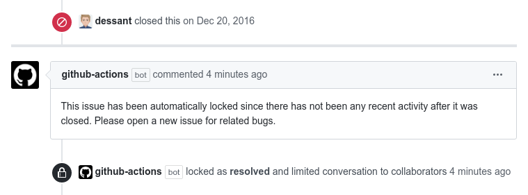

# Lock Threads

[](https://travis-ci.com/dessant/lock-threads)
[](https://www.npmjs.com/package/lock-threads)

Lock Threads is a GitHub App inspired by [Stale](https://github.com/probot/stale)
and built with [Probot](https://github.com/probot/probot)
that locks closed issues and pull requests after a period of inactivity.



## Supporting the Project

The continued development of Lock Threads is made possible
thanks to the support of awesome backers. If you'd like to join them,
please consider contributing with
[Patreon](https://armin.dev/go/patreon?pr=lock-threads&src=repo),
[PayPal](https://armin.dev/go/paypal?pr=lock-threads&src=repo) or
[Bitcoin](https://armin.dev/go/bitcoin?pr=lock-threads&src=repo).

## Usage

1. **[Install the GitHub App](https://github.com/apps/lock)**
   for the intended repositories
2. Create `.github/lock.yml` based on the template below
3. It will start scanning for closed issues and/or pull requests within an hour

**If possible, install the app only for select repositories.
Do not leave the `All repositories` option selected, unless you intend
to use the app for all current and future repositories.**

#### Configuration

Create `.github/lock.yml` in the default branch to enable the app,
or add it at the same file path to a repository named `.github`.
The file can be empty, or it can override any of these default settings:

```yaml
# Configuration for Lock Threads - https://github.com/dessant/lock-threads

# Number of days of inactivity before a closed issue or pull request is locked
daysUntilLock: 365

# Skip issues and pull requests created before a given timestamp. Timestamp must
# follow ISO 8601 (`YYYY-MM-DD`). Set to `false` to disable
skipCreatedBefore: false

# Issues and pull requests with these labels will be ignored. Set to `[]` to disable
exemptLabels: []

# Label to add before locking, such as `outdated`. Set to `false` to disable
lockLabel: false

# Comment to post before locking. Set to `false` to disable
lockComment: >
  This thread has been automatically locked since there has not been
  any recent activity after it was closed. Please open a new issue for
  related bugs.

# Assign `resolved` as the reason for locking. Set to `false` to disable
setLockReason: true

# Limit to only `issues` or `pulls`
# only: issues

# Optionally, specify configuration settings just for `issues` or `pulls`
# issues:
#   exemptLabels:
#     - help-wanted
#   lockLabel: outdated

# pulls:
#   daysUntilLock: 30

# Repository to extend settings from
# _extends: repo
```

## How are issues and pull requests determined to be inactive?

The app uses GitHub's [updated](https://git.io/fhRnE) search qualifier
to determine inactivity. Any change to an issue or pull request
is considered an update, including comments, changing labels,
applying or removing milestones, or pushing commits.

An easy way to check and see which issues or pull requests will initially
be locked is to add the `updated` search qualifier to either the issue
or pull request page filter for your repository:
`is:closed is:unlocked updated:<2016-12-20`.
Adjust the date to be 365 days ago (or whatever you set for `daysUntilLock`)
to see which issues or pull requests will be locked.

## Why are only some issues and pull requests processed?

To avoid triggering abuse prevention mechanisms on GitHub, only 30 issues
and pull requests will be handled per hour. If your repository has more
than that, it will just take a few hours or days to process them all.

## Deployment

See [docs/deploy.md](docs/deploy.md) if you would like to run your own
instance of this app.

## License

Copyright (c) 2017-2019 Armin Sebastian

This software is released under the terms of the MIT License.
See the [LICENSE](LICENSE) file for further information.
